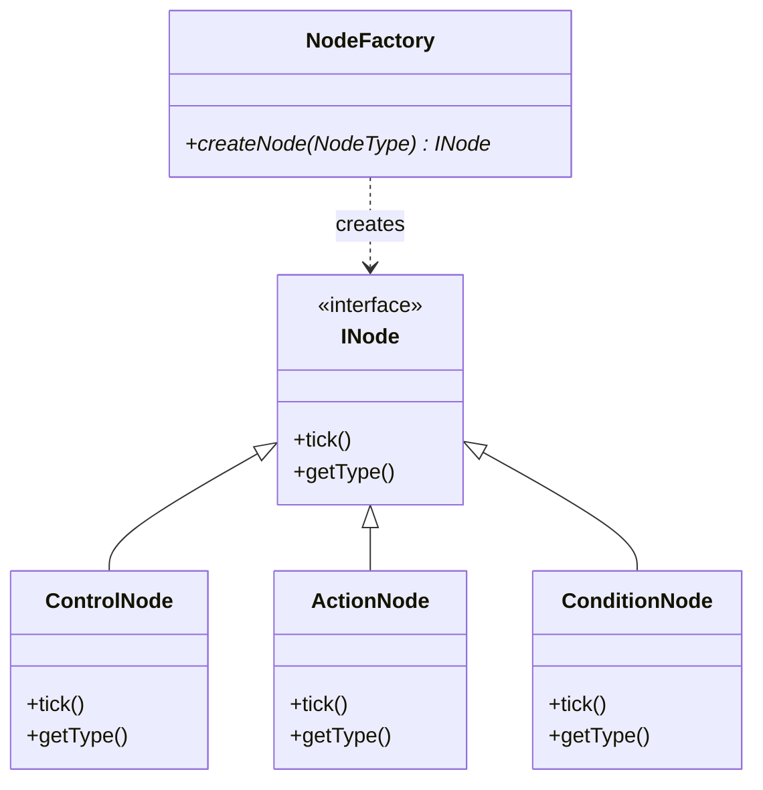
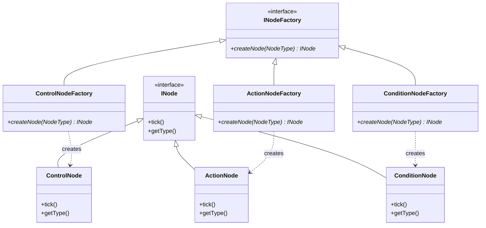
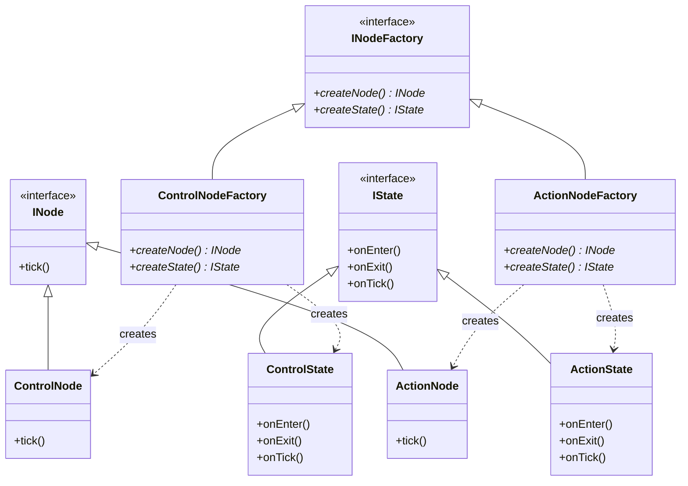
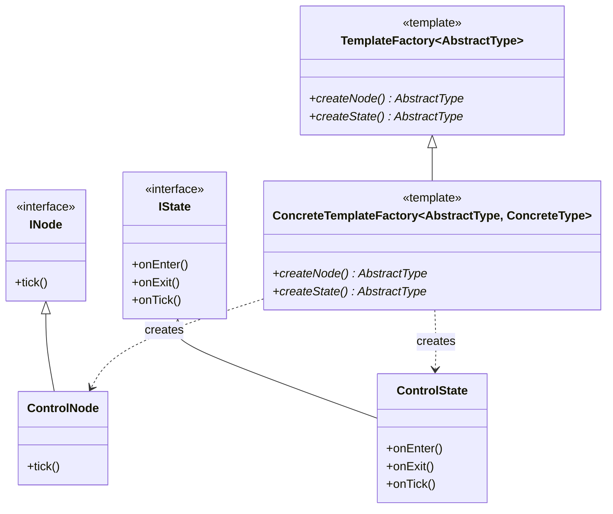
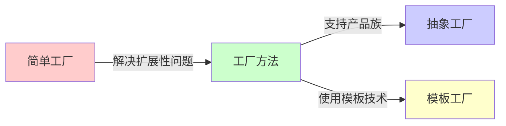

<!--
 * @Descripttion: 工厂模式学习指南
 * @Author: jev
 * @Date: 2025-11-25
-->

# 工厂模式学习指南

本目录包含了四种工厂模式的完整实现示例，从简单到复杂，逐步展示工厂模式的演进过程。

## 📚 目录内容

- **简单工厂** (`simple_factory.cpp`) - 最基础的工厂模式
- **工厂方法** (`factory_method.cpp`) - 解决简单工厂的扩展性问题
- **抽象工厂** (`abstract_factory.cpp`) - 创建产品族
- **模板工厂** (`template_factory.cpp`) - 使用模板的现代化实现

## 🎯 工厂模式概述

工厂模式是一种创建型设计模式，它提供了一种创建对象的最佳方式。在工厂模式中，我们在创建对象时不会对客户端暴露创建逻辑，而是通过使用一个共同的接口来指向新创建的对象。

## 📖 四种工厂模式详解

### 1. 简单工厂 (Simple Factory)

**原理**：
- 一个工厂类根据传入的参数决定创建哪种产品类的实例
- 所有产品的创建逻辑都集中在一个工厂类中

**优点**：
- 实现简单，易于理解
- 客户端不需要知道具体产品类的名称

**缺点**：
- 违反开闭原则：添加新产品需要修改工厂类的代码
- 工厂类职责过重，不符合单一职责原则

**适用场景**：
- 产品类型较少且相对固定
- 客户端不需要关心产品的创建细节

**类图结构**：


**执行步骤**：
1. 定义抽象产品接口 `INode`
2. 实现具体产品类（ControlNode、ActionNode、ConditionNode）
3. 创建工厂类 `NodeFactory`，包含静态方法 `createNode`
4. 客户端通过工厂类创建产品实例

### 2. 工厂方法 (Factory Method)

**原理**：
- 定义一个用于创建对象的接口，让子类决定实例化哪一个类
- 每个具体产品都有对应的具体工厂
- 将对象的创建延迟到子类

**优点**：
- 符合开闭原则：添加新产品只需添加新的工厂类
- 符合单一职责原则：每个工厂只负责创建一种产品
- 符合依赖倒置原则：依赖抽象而非具体类

**缺点**：
- 类的数量增加，系统复杂度提高
- 增加了代码的抽象性和理解难度

**适用场景**：
- 需要创建的产品类型较多且可能扩展
- 客户端不需要知道具体产品类的名称

**类图结构**：


**执行步骤**：
1. 定义抽象产品接口 `INode`
2. 实现具体产品类
3. 定义抽象工厂接口 `INodeFactory`
4. 为每个具体产品创建对应的具体工厂类
5. 客户端使用具体工厂创建产品实例

### 3. 抽象工厂 (Abstract Factory)

**原理**：
- 提供一个创建一系列相关或相互依赖对象的接口，而无需指定它们具体的类
- 可以创建产品族（多个相关的产品）
- 每个具体工厂可以创建多个不同类型的产品

**优点**：
- 保证客户端只使用同一产品族中的对象
- 符合开闭原则：添加新的产品族很容易
- 产品族内的产品可以一起工作

**缺点**：
- 难以支持新种类的产品（需要修改抽象工厂接口）
- 类的数量大幅增加
- 增加了系统的抽象性和理解难度

**适用场景**：
- 系统需要创建多个产品族
- 需要保证产品族内产品的一致性
- 产品族相对稳定，不会频繁添加新的产品种类

**类图结构**：


**执行步骤**：
1. 定义多个抽象产品接口（INode、IState）
2. 实现具体产品类（每个产品族对应多个产品）
3. 定义抽象工厂接口，包含创建所有产品的方法
4. 实现具体工厂类，创建同一产品族的所有产品
5. 客户端使用具体工厂创建产品族

### 4. 模板工厂 (Template Factory)

**原理**：
- 使用 C++ 模板技术实现工厂模式
- 通过模板参数指定抽象类型和具体类型
- 编译期多态，性能更好

**优点**：
- 类型安全，编译期检查
- 性能好，无运行时开销
- 代码复用性高
- 符合现代 C++ 设计理念

**缺点**：
- 模板代码可读性较差
- 错误信息复杂难懂
- 需要编译器支持模板特性

**适用场景**：
- 性能要求高的场景
- 类型在编译期确定
- 需要充分利用 C++ 模板特性

**类图结构**：


**执行步骤**：
1. 定义抽象产品接口
2. 实现具体产品类
3. 定义模板工厂基类 `TemplateFactory<AbstractType>`
4. 定义具体模板工厂类 `ConcreteTemplateFactory<AbstractType, ConcreteType>`
5. 客户端通过模板参数指定类型创建工厂实例

## 🔄 模式演进关系



## 🚀 编译和运行

所有示例代码都可以使用以下方式编译：

```bash
# 简单工厂
g++ simple_factory.cpp -o simple_factory -std=c++11
./simple_factory

# 工厂方法
g++ factory_method.cpp -o factory_method -std=c++11
./factory_method

# 抽象工厂
g++ abstract_factory.cpp -o abstract_factory -std=c++11
./abstract_factory

# 模板工厂
g++ template_factory.cpp -o template_factory -std=c++11
./template_factory
```

## 📊 测试用例和预期结果

### 简单工厂测试用例

| 用例 | 输入 | 预期输出 |
|------|------|----------|
| 1 | NodeType::CONTROL | "ControlNode tick" |
| 2 | NodeType::ACTION | "ActionNode tick" |
| 3 | NodeType::CONDITION | "ConditionNode tick" |
| 4 | 无效类型 | nullptr (不输出) |

### 工厂方法测试用例

| 用例 | 工厂类型 | 预期输出 |
|------|----------|----------|
| 5 | ControlNodeFactory | "ControlNode tick" |
| 6 | ActionNodeFactory | "ActionNode tick" |
| 7 | ConditionNodeFactory | "ConditionNode tick" |

### 抽象工厂测试用例

| 用例 | 工厂类型 | 创建对象 | 预期输出 |
|------|----------|----------|----------|
| 8 | ControlNodeFactory | Node | "ControlNode tick" |
| 9 | ControlNodeFactory | State | "ControlState onTick" |
| 10 | ActionNodeFactory | Node + State | "ActionNode tick" + "ActionState onTick" |

## 💡 学习建议

1. **按顺序学习**：从简单工厂开始，逐步理解每种模式的改进点
2. **对比差异**：重点关注每种模式解决的问题和适用场景
3. **实践修改**：尝试添加新的产品类型，观察不同模式下的修改成本
4. **理解演进**：理解为什么需要从简单工厂演进到其他模式

## 📝 关键区别总结

| 特性 | 简单工厂 | 工厂方法 | 抽象工厂 | 模板工厂 |
|------|----------|----------|----------|----------|
| 工厂类数量 | 1个 | N个（产品数） | N个（产品族数） | 模板类 |
| 扩展新产品 | 修改工厂类 | 添加新工厂类 | 添加新工厂类 | 实例化新模板 |
| 支持产品族 | ❌ | ❌ | ✅ | ✅ |
| 编译期检查 | ❌ | ❌ | ❌ | ✅ |
| 性能开销 | 运行时 | 运行时 | 运行时 | 编译期 |

## 🔗 相关资源

- [设计模式：可复用面向对象软件的基础](https://book.douban.com/subject/1052241/)
- [C++ 模板编程](https://zh.cppreference.com/w/cpp/language/templates)

---

**作者**: jev  
**最后更新**: 2025-11-25
